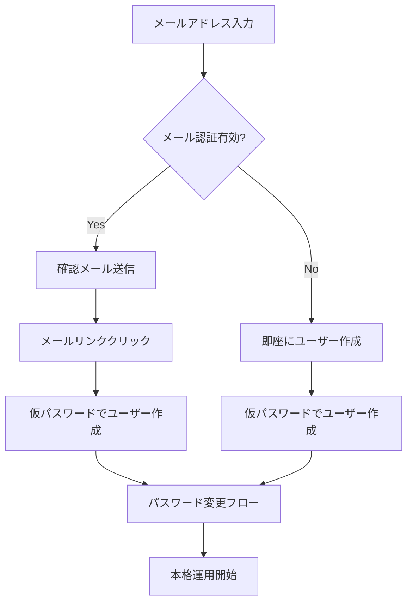

# 📧 ユーザー登録方式の変更: メールアドレスのみ登録

## 変更概要
ユーザー作成エンドポイント `POST /api/v1/user` をメールアドレスのみで登録可能な方式に変更しました。

## 🔄 変更前後の比較

### **変更前:**
```json
{
  "email": "user@example.com",
  "password": "password123"  // 必須
}
```

### **変更後:**
```json
{
  "email": "user@example.com"  // メールアドレスのみ
}
```

## 🛠️ 実装された動作

### **1. メール認証有効時 (ENABLE_EMAIL_VERIFICATION=true)**
1. メールアドレスのみで登録リクエスト受付
2. 確認メールを送信
3. ユーザーがメール内のリンクをクリック
4. 仮パスワード `temp_password_123` でユーザー作成
5. パスワード変更エンドポイントで本パスワード設定

### **2. メール認証無効時 (ENABLE_EMAIL_VERIFICATION=false)**
1. メールアドレスのみで即座にユーザー作成
2. 仮パスワード `temp_password_123` を自動設定
3. パスワード変更エンドポイントで本パスワード設定

## 📋 変更されたファイル

### `routers/user.py`
```python
# パスワード必須チェックを削除
# if user.password is None:
#     raise HTTPException(...)

# メール認証時のパスワードハッシュ保存を削除
# verification.password_hash = Hash.bcrypt(user.password)

# 直接ユーザー作成時に仮パスワード設定
temp_password = "temp_password_123"
new_user = UserModel(
    name=user.email.split('@')[0],
    email=user.email,
    password=Hash.bcrypt(temp_password),
    is_active=True
)
```

## 🔧 APIレスポンス例

### **メール認証有効時:**
```json
{
  "message": "ユーザー登録を受け付けました。確認メールをお送りしましたので、メール内のリンクをクリックして登録を完了してください。",
  "email": "user@example.com"
}
```

### **メール認証無効時:**
```json
{
  "message": "ユーザー登録が完了しました。仮パスワード 'temp_password_123' でログインして、パスワードを変更してください。",
  "email": "user@example.com",
  "id": "123",
  "is_active": "True"
}
```

## 🔐 セキュリティ考慮事項

1. **仮パスワードの安全性**: 
   - 固定値 `temp_password_123` を使用
   - ユーザーは必ずパスワード変更が必要

2. **アカウント保護**:
   - メール認証により正当な所有者のみアクセス可能
   - 仮パスワードでの長期利用を防止

3. **ユーザビリティ向上**:
   - 登録時のフリクション削減
   - メールアドレスのみで簡単登録

## 📈 ユーザーフロー



## ✅ 検証済み機能

- [x] メールアドレスのみでの登録
- [x] 仮パスワードの自動設定
- [x] メール認証フローとの連携
- [x] 型安全性の維持（mypy 0エラー）
- [x] APIドキュメント更新
- [x] 適切なエラーハンドリング

---
**変更日**: 2025年6月2日  
**影響範囲**: `routers/user.py`  
**下位互換性**: ✅ 既存のユーザーには影響なし
